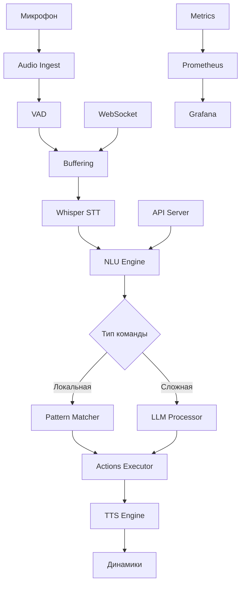

# KLARNET Voice Assistant - Windows Edition

<div align="center">


[](https://www.microsoft.com/windows)
[](https://www.rust-lang.org/)
[](https://www.python.org/)
[](https://developer.nvidia.com/cuda-toolkit)

**Высокопроизводительный офлайн голосовой ассистент на Rust**

[Установка](#-установка) • [Быстрый старт](#-быстрый-старт) • [Команды](#-команды) • [API](#-api) • [Настройка](#️-настройка) • [FAQ](#-faq)

</div>

---

## 📋 Содержание

- [О проекте](#-о-проекте)
- [Возможности](#-возможности)
- [Системные требования](#-системные-требования)
- [Установка](#-установка)
- [Быстрый старт](#-быстрый-старт)
- [Архитектура](#️-архитектура)
- [Команды](#-команды)
- [API документация](#-api-документация)
- [Настройка](#️-настройка)
- [Разработка](#-разработка)
- [Тестирование](#-тестирование)
- [Производительность](#-производительность)
- [Troubleshooting](#-troubleshooting)
- [FAQ](#-faq)

---

## 🎯 О проекте

**KLARNET** - это production-ready голосовой ассистент с минимальной задержкой (~200-300мс), работающий полностью офлайн (кроме опциональных LLM функций). Написан на Rust для максимальной производительности и надежности.

### Ключевые особенности

- ⚡ **Ультранизкая задержка**: 200-300мс для локальных команд
- 🔒 **Полностью офлайн**: Работает без интернета (кроме LLM)
- 🎙️ **Реальный STT**: Faster-Whisper Medium с GPU ускорением
- 🧠 **Гибридный NLU**: Паттерны + LLM fallback
- 🏠 **Умный дом**: Интеграция с Home Assistant
- 📊 **Production-ready**: Метрики, мониторинг, Docker
- 🔧 **Модульность**: 13 независимых crates

---

## ✨ Возможности

### Распознавание речи
- Faster-Whisper Medium модель
- Поддержка русского и английского языков
- Word-level timestamps
- Streaming обработка
- RTF < 0.04x на GPU

### Обработка команд
- Локальные паттерны для быстрых команд
- LLM интеграция для сложных запросов
- Настраиваемые wake words
- Контекстное понимание

### Интеграции
- **Системные команды**: Управление Windows
- **Умный дом**: Home Assistant API
- **Веб-действия**: Открытие сайтов, поиск
- **Пользовательские скрипты**: PowerShell/Python

### API и интерфейсы
- HTTP REST API
- WebSocket для streaming
- gRPC для микросервисов
- Prometheus метрики
- Grafana дашборды

---

## 💻 Системные требования

### Минимальные требования

| Компонент | Требование |
|-----------|------------|
| **ОС** | Windows 10/11 (64-bit) |
| **Процессор** | Intel Core i5 / AMD Ryzen 5 |
| **Память** | 8 GB RAM |
| **Диск** | 10 GB свободного места |
| **Аудио** | Любой микрофон |

### Рекомендуемые требования

| Компонент | Требование |
|-----------|------------|
| **ОС** | Windows 11 Pro |
| **Процессор** | Intel Core i7 / AMD Ryzen 7 |
| **Память** | 16 GB RAM |
| **GPU** | NVIDIA RTX 3060+ с CUDA 12.1 |
| **Диск** | 20 GB SSD |
| **Аудио** | Качественный микрофон с шумоподавлением |

### Программные зависимости

- **Rust** 1.75 или выше
- **Python** 3.8-3.11
- **Visual Studio Build Tools** 2019/2022
- **CUDA Toolkit** 12.1 (опционально для GPU)
- **Git** для клонирования репозитория

---

## 📦 Установка

### Способ 1: Автоматическая установка (Рекомендуется)

```powershell
# 1. Клонируйте репозиторий
git clone https://github.com/yourusername/klarnet.git
cd KLARNET

# 2. Запустите установщик
.\scripts\install.bat

# 3. Следуйте инструкциям установщика
```

### Способ 2: Ручная установка

#### Шаг 1: Установка зависимостей

```powershell
# Установка Rust
Invoke-WebRequest https://win.rustup.rs/x86_64 -OutFile rustup-init.exe
.\rustup-init.exe -y
$env:PATH = "$env:USERPROFILE\.cargo\bin;$env:PATH"

# Проверка установки
rustc --version
cargo --version
```

#### Шаг 2: Установка Python и пакетов

```powershell
# Скачайте Python с https://python.org
# Или через winget:
winget install Python.Python.3.11

# Установка Python зависимостей
pip install --upgrade pip
pip install -r requirements.txt
```

#### Шаг 3: Установка Visual Studio Build Tools

```powershell
# Скачайте и установите:
# https://visualstudio.microsoft.com/visual-cpp-build-tools/
# Выберите "Desktop development with C++"
```

#### Шаг 4: Установка CUDA (для GPU)

```powershell
# 1. Проверьте совместимость GPU
nvidia-smi

# 2. Скачайте CUDA Toolkit 12.1
# https://developer.nvidia.com/cuda-12-1-0-download-archive

# 3. Установите cuDNN
# https://developer.nvidia.com/cudnn-downloads

# 4. Добавьте в PATH
$env:PATH += ";C:\Program Files\NVIDIA GPU Computing Toolkit\CUDA\v12.1\bin"
```

#### Шаг 5: Загрузка моделей

```powershell
# Создание директорий
New-Item -ItemType Directory -Force -Path models, cache, logs

# Загрузка Whisper модели
python scripts\download_model.py --size medium --output models\

# Для CPU версии можно использовать small
python scripts\download_model.py --size small --output models\
```

#### Шаг 6: Сборка проекта

```powershell
# Debug сборка (для разработки)
cargo build

# Release сборка (оптимизированная)
cargo build --release

# С поддержкой GPU
cargo build --release --features gpu
```

---

## 🚀 Быстрый старт

### 1️⃣ Базовая конфигурация

Создайте файл `config/klarnet.toml`:

```toml
[app]
language = "ru"
mode = "cpu"  # или "gpu" если есть CUDA
log_level = "info"

[audio]
sample_rate = 16000
device = "default"  # или имя конкретного устройства

[stt]
model_path = "models/whisper-medium"
compute_type = "int8"  # или "int8_float16" для GPU

[nlu]
wake_words = ["джарвис", "ассистент", "компьютер"]

[api]
enabled = true
port = 3000
```

### 2️⃣ Запуск ассистента

```powershell
# Вариант 1: Через Cargo
cargo run --release

# Вариант 2: Напрямую exe
.\target\release\klarnet.exe

# Вариант 3: С параметрами
.\target\release\klarnet.exe --config config\my_config.toml

# Вариант 4: PowerShell скрипт
.\run.ps1
```

### 3️⃣ Проверка работы

```powershell
# Проверка health
curl http://localhost:3000/health

# Откройте в браузере
start http://localhost:3000

# Скажите в микрофон
"Джарвис, включи свет"
```

---

## 🏗️ Архитектура



### Модульная структура

| Модуль | Описание | Размер |
|--------|----------|--------|
| `core` | Базовые типы и трейты | ~50 KB |
| `audio_ingest` | Захват аудио с микрофона | ~200 KB |
| `vad` | Детекция речи (WebRTC VAD) | ~150 KB |
| `buffering` | Управление аудио буферами | ~100 KB |
| `whisper_stt` | Speech-to-Text движок | ~500 KB |
| `nlu` | Natural Language Understanding | ~300 KB |
| `actions` | Исполнение команд | ~250 KB |
| `tts` | Text-to-Speech | ~200 KB |
| `api` | HTTP/WebSocket/gRPC сервер | ~400 KB |
| `config` | Управление конфигурацией | ~100 KB |

---

## 🎤 Команды

### Системные команды

| Команда | Действие |
|---------|----------|
| "Открой блокнот" | Запускает Notepad |
| "Открой браузер" | Запускает Chrome/Edge |
| "Громкость 50" | Устанавливает громкость |
| "Заблокируй компьютер" | Блокирует Windows |
| "Сделай скриншот" | Снимок экрана |

### Умный дом

| Команда | Действие |
|---------|----------|
| "Включи свет в гостиной" | Управление освещением |
| "Выключи все" | Выключить все устройства |
| "Температура 22 градуса" | Установка термостата |
| "Включи кондиционер" | Управление климатом |

### Ассистент

| Команда | Действие |
|---------|----------|
| "Поставь таймер на 5 минут" | Таймер |
| "Какая погода?" | Прогноз погоды (LLM) |
| "Напомни через час" | Напоминание |
| "Найди в интернете..." | Веб-поиск |

### Пользовательские команды

Создайте файл `config/patterns.yaml`:

```yaml
intents:
  - name: custom_command
    patterns:
      - "выполни мой скрипт"
      - "запусти автоматизацию"
    action: custom.my_script
    confidence: 0.9
```

И скрипт `scripts/actions/my_script.ps1`:

```powershell
# Ваш PowerShell скрипт
Write-Host "Выполняю пользовательскую команду"
# Любые действия
```

---

## 📡 API Документация

### REST API Endpoints

#### Health Check
```http
GET /health
```

Ответ:
```json
{
  "status": "healthy",
  "version": "0.1.0",
  "uptime_seconds": 3600
}
```

#### Transcribe Audio
```http
POST /stt/file
Content-Type: audio/wav

[binary audio data]
```

Ответ:
```json
{
  "text": "распознанный текст",
  "language": "ru",
  "segments": [...]
}
```

#### Interpret Text
```http
POST /nlu/interpret
Content-Type: application/json

{
  "text": "включи свет"
}
```

Ответ:
```json
{
  "intent": "lights_on",
  "entities": {...},
  "confidence": 0.95
}
```

#### Metrics
```http
GET /metrics
```

Prometheus метрики в text формате.

### WebSocket API

#### Подключение
```javascript
const ws = new WebSocket('ws://localhost:3000/stt/stream');

ws.onopen = () => {
  console.log('Connected');
};

ws.onmessage = (event) => {
  const data = JSON.parse(event.data);
  console.log('Transcript:', data.text);
};

// Отправка аудио
ws.send(audioBuffer);
```

### gRPC API

```protobuf
service SttService {
  rpc Transcribe(TranscribeRequest) returns (TranscribeResponse);
  rpc StreamTranscribe(stream StreamRequest) returns (stream StreamResponse);
}
```

---

## ⚙️ Настройка

### Основной конфиг `config/klarnet.toml`

```toml
[app]
language = "ru"                # Язык: ru, en
mode = "gpu"                   # gpu или cpu
pre_roll_ms = 1000             # Буфер до начала речи
max_utterance_s = 120          # Макс. длина фразы
log_level = "info"             # trace, debug, info, warn, error

[audio]
sample_rate = 16000            # Частота дискретизации
channels = 1                   # Моно
bits_per_sample = 16          
buffer_size = 1024            
device = "Microphone (Realtek)" # Имя устройства Windows

[vad]
mode = "webrtc"                # webrtc, energy, hybrid
aggressiveness = 2             # 0-3 (выше = строже)
frame_duration_ms = 30         # 10, 20 или 30
min_speech_duration_ms = 200  # Мин. длина речи
min_silence_duration_ms = 500 # Пауза для конца фразы

[stt]
model_path = "models/whisper-medium"
model_size = "medium"          # tiny, base, small, medium, large
compute_type = "int8_float16"  # int8, int8_float16, float16, float32
language = "ru"
beam_size = 5                  # 1-10 (качество vs скорость)
vad_filter = true
word_timestamps = true
device = "cuda"                # cuda или cpu
device_index = 0               # Индекс GPU

[nlu]
mode = "hybrid"                # local, llm, hybrid
wake_words = ["джарвис", "ассистент", "эй компьютер"]
confidence_threshold = 0.7

[nlu.llm]
provider = "openrouter"        # openrouter, deepseek, openai
model = "deepseek/deepseek-chat"
api_key_env = "OPENROUTER_API_KEY"
max_tokens = 500
temperature = 0.3
timeout_s = 5

[actions]
enabled_modules = ["system", "smart_home", "web", "custom"]
scripts_dir = "scripts/actions"

[actions.smart_home]
api_url = "http://192.168.1.100:8123"
api_token_env = "HASS_TOKEN"

[tts]
enabled = true
engine = "silero"              # silero, piper, windows_sapi
model = "v3_1_ru"
speaker = "xenia"              # xenia, baya, kseniya, eugene
sample_rate = 48000
speed = 1.0

[api]
enabled = true
host = "0.0.0.0"
port = 3000
cors_origins = ["*"]

[metrics]
enabled = true
prometheus_port = 9090
export_interval_s = 10
```

### Переменные окружения `.env`

```env
# API ключи
OPENROUTER_API_KEY=sk-or-v1-xxxxx
DEEPSEEK_API_KEY=sk-xxxxx
OPENAI_API_KEY=sk-xxxxx

# Умный дом
HASS_TOKEN=eyJ0eXAiOiJKV1QiLCJhbGciOiJIUzI1NiJ9.xxxxx

# Пути (опционально)
KLARNET_CONFIG=C:\Users\YourName\KLARNET\config\klarnet.toml
KLARNET_MODELS=C:\Users\YourName\KLARNET\models

# Отладка
RUST_LOG=klarnet=debug,info
RUST_BACKTRACE=full

# GPU (если есть)
CUDA_VISIBLE_DEVICES=0
```

### Настройка микрофона

1. Найдите ваше аудио устройство:

```python
import sounddevice as sd
print(sd.query_devices())
```

2. Укажите в конфиге:

```toml
[audio]
device = "Microphone (Realtek High Definition Audio)"
```

---

## 👨‍💻 Разработка

### Структура проекта

```
KLARNET/
├── src/              # Основное приложение
├── crates/           # Модули
│   ├── core/        # Базовые типы
│   ├── audio_ingest/
│   ├── vad/
│   ├── whisper_stt/
│   ├── nlu/
│   ├── actions/
│   ├── tts/
│   └── api/
├── config/           # Конфигурации
├── scripts/          # Скрипты
├── models/           # ML модели
├── tests/            # Тесты
└── target/           # Скомпилированные файлы
```

### Добавление новых команд

1. Добавьте паттерн в `config/patterns.yaml`:

```yaml
- name: my_command
  patterns:
    - "моя команда"
    - "выполни действие"
  action: custom.my_action
```

2. Создайте обработчик `src/commands/my_action.rs`:

```rust
pub async fn handle_my_action(params: &LocalCommand) -> ActionResult {
    // Ваша логика
    Ok(ActionResult::success_with_message(
        "Команда выполнена".to_string()
    ))
}
```

### Компиляция с флагами

```powershell
# Только CPU версия
cargo build --release --no-default-features --features cpu

# С поддержкой GPU
cargo build --release --features gpu,cuda

# Минимальная версия
cargo build --release --features minimal

# Debug с логами
$env:RUST_LOG="trace"
cargo build
```

---

## 🧪 Тестирование

### Запуск тестов

```powershell
# Все тесты
cargo test

# Только unit тесты
cargo test --lib

# Интеграционные тесты
cargo test --test integration_test

# С выводом
cargo test -- --nocapture

# Конкретный тест
cargo test test_vad_detection
```

### Тестирование аудио

```powershell
# Тест микрофона
python scripts\test_audio.py

# Тест VAD
python scripts\test_vad.py

# Тест полного pipeline
.\tests\test_pipeline.ps1
```

### Бенчмарки

```powershell
# Запуск бенчмарков
cargo bench

# Профилирование
cargo build --release --features profiling
.\target\release\klarnet.exe --profile
```

### E2E тесты

```powershell
# PowerShell скрипт для E2E
.\tests\e2e_test.ps1

# Или Python версия
python tests\e2e_test.py
```

---

## 📊 Производительность

### Метрики на RTX 3080 Ti

| Операция | Время | RTF |
|----------|-------|-----|
| VAD (30ms фрейм) | 0.5ms | 0.017x |
| STT (1 сек) | 40ms | 0.04x |
| STT (10 сек) | 400ms | 0.04x |
| NLU (паттерн) | 1ms | - |
| NLU (LLM) | 500-1500ms | - |
| TTS (предложение) | 50ms | - |
| **Полный цикл** | **200-300ms** | - |

### Метрики на CPU (i7-12700K)

| Операция | Время | RTF |
|----------|-------|-----|
| VAD | 2ms | 0.067x |
| STT (1 сек) | 250ms | 0.25x |
| STT (10 сек) | 2500ms | 0.25x |
| **Полный цикл** | **500-700ms** | - |

### Потребление ресурсов

| Ресурс | Idle | Активно | Пик |
|--------|------|---------|-----|
| CPU | 1-2% | 10-15% | 30% |
| RAM | 1.5 GB | 2-3 GB | 4 GB |
| GPU RAM | 1.2 GB | 1.5 GB | 2 GB |
| Диск I/O | 0 MB/s | 5 MB/s | 20 MB/s |

---

## 🐛 Troubleshooting

### Проблема: Не находит микрофон

```powershell
# Решение 1: Проверить устройства
python -c "import sounddevice; print(sounddevice.query_devices())"

# Решение 2: Указать конкретное устройство в конфиге
[audio]
device = "Microphone (USB Audio Device)"

# Решение 3: Использовать индекс устройства
[audio]
device = "2"  # Номер из списка устройств
```

### Проблема: CUDA не работает

```powershell
# Проверка 1: CUDA установлена?
nvidia-smi
nvcc --version

# Проверка 2: PATH правильный?
echo $env:PATH

# Решение: Добавить в PATH
$env:PATH += ";C:\Program Files\NVIDIA GPU Computing Toolkit\CUDA\v12.1\bin"
$env:PATH += ";C:\Program Files\NVIDIA GPU Computing Toolkit\CUDA\v12.1\libnvvp"

# Переустановка CUDA
# Скачать с https://developer.nvidia.com/cuda-downloads
```

### Проблема: Ошибка компиляции

```powershell
# Решение 1: Установить Build Tools
# https://visualstudio.microsoft.com/visual-cpp-build-tools/

# Решение 2: Использовать GNU toolchain
rustup default stable-x86_64-pc-windows-gnu

# Решение 3: Очистить кэш
cargo clean
rm -r target/

# Решение 4: Обновить Rust
rustup update
```

### Проблема: Python модули не импортируются

```powershell
# Решение 1: Виртуальное окружение
python -m venv venv
.\venv\Scripts\Activate
pip install -r requirements.txt

# Решение 2: Переустановка
pip uninstall -y faster-whisper torch
pip install --no-cache-dir faster-whisper torch

# Решение 3: Проверить версию Python
python --version  # Должно быть 3.8-3.11
```

### Проблема: Высокая задержка

```toml
# Оптимизация конфига:

[stt]
beam_size = 1  # Уменьшить для скорости
vad_filter = true  # Включить фильтрацию

[vad]
aggressiveness = 3  # Строже VAD

[buffering]
chunk_duration_ms = 1000  # Меньше буфер
```

### Проблема: Не работает TTS

```powershell
# Решение 1: Проверить Python сервер
python scripts\silero_tts.py

# Решение 2: Использовать Windows SAPI
[tts]
engine = "windows_sapi"

# Решение 3: Проверить аудио выход
python -c "import sounddevice; sounddevice.play([0.5]*16000, 16000)"
```

---

## ❓ FAQ

### Q: Можно ли использовать без GPU?
**A:** Да! Используйте CPU режим в конфиге:
```toml
[app]
mode = "cpu"
[stt]
device = "cpu"
compute_type = "int8"
```

### Q: Какие языки поддерживаются?
**A:** Из коробки - русский и английский. Можно добавить другие, скачав соответствующую модель Whisper.

### Q: Как добавить свой wake word?
**A:** В конфиге `config/klarnet.toml`:
```toml
[nlu]
wake_words = ["мой ассистент", "слушай", "окей компьютер"]
```

### Q: Можно ли использовать другие LLM?
**A:** Да, поддерживаются:
- OpenRouter (DeepSeek, Claude, GPT)
- OpenAI API
- Локальные модели через Ollama

### Q: Как интегрировать с умным домом?
**A:** Настройте Home Assistant:
```toml
[actions.smart_home]
api_url = "http://your-ha-instance:8123"
api_token_env = "HASS_TOKEN"
```

### Q: Работает ли на Windows 7/8?
**A:** Нет, минимум Windows 10 (1903+). Рекомендуется Windows 11.

### Q: Можно ли запустить как службу Windows?
**A:** Да:
```powershell
.\deploy\install-service.ps1
```

### Q: Как изменить голос TTS?
**A:** В конфиге:
```toml
[tts]
speaker = "baya"  # xenia, baya, kseniya, eugene
```

### Q: Поддерживается ли Docker?
**A:** Да:
```powershell
docker build -f Dockerfile.windows -t klarnet:windows .
docker run -d klarnet:windows
```

### Q: Где хранятся логи?
**A:** В папке `logs/`. Уровень логирования:
```powershell
$env:RUST_LOG="debug"
```

---

## 🤝 Участие в разработке

### Как помочь проекту

1. 🐛 Сообщайте об ошибках через Issues
2. 💡 Предлагайте новые функции
3. 📝 Улучшайте документацию
4. 🔧 Отправляйте Pull Requests
5. ⭐ Ставьте звезды на GitHub

### Разработка

```powershell
# Форк репозитория
git clone https://github.com/yourusername/klarnet.git
cd KLARNET

# Создайте ветку
git checkout -b feature/my-feature

# Внесите изменения и протестируйте
cargo test
cargo fmt
cargo clippy

# Коммит
git add .
git commit -m "Add: my feature"

# Push и создайте PR
git push origin feature/my-feature
```

### Стиль кода

- Используйте `cargo fmt` для форматирования
- Проверяйте `cargo clippy`
- Пишите тесты для новых функций
- Документируйте публичные API

---

## 📄 Лицензия

MIT License - см. файл [LICENSE](LICENSE)

---

## 🙏 Благодарности

- [Faster-Whisper](https://github.com/systran/faster-whisper) - STT движок
- [Silero Models](https://